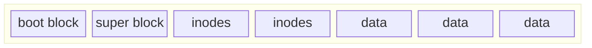
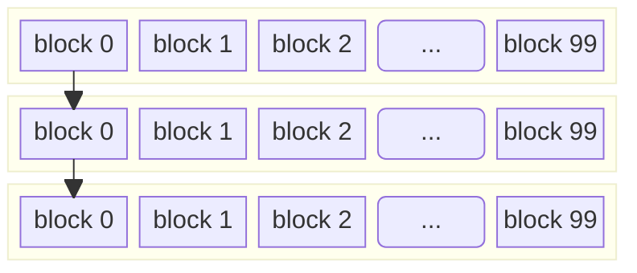

# StupidFS

## License

StupidFS is dual-licensed under both CeCiLL-B and BSD-3-Clause licenses.

The full text of the CeCiLL-B license can be accessed via [this link](https://cecill.info/licences/Licence_CeCILL-B_V1-en.html) and is also included in [the license file](LICENSE) of this software package.

The full text of the BSD-3-Clause license can be accessed via [this link](https://opensource.org/licenses/BSD-3-Clause) and is also included in [the license file](LICENSE.BSD3) of this software package.
